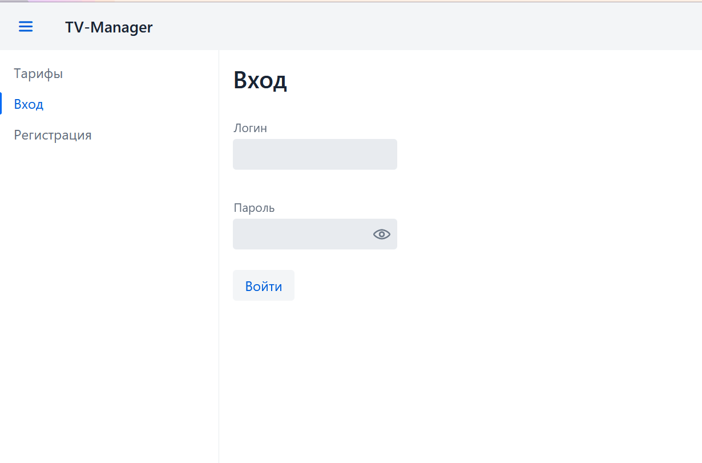
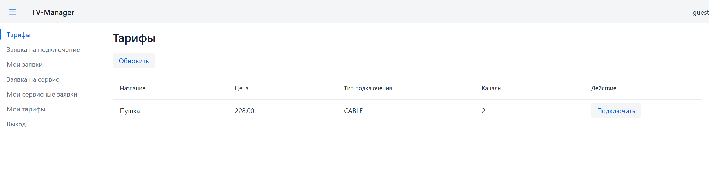
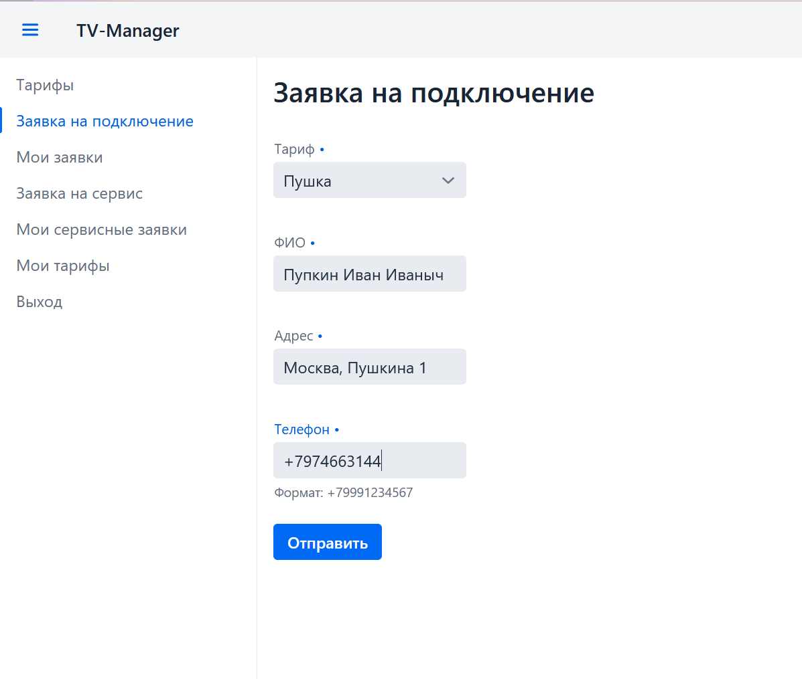
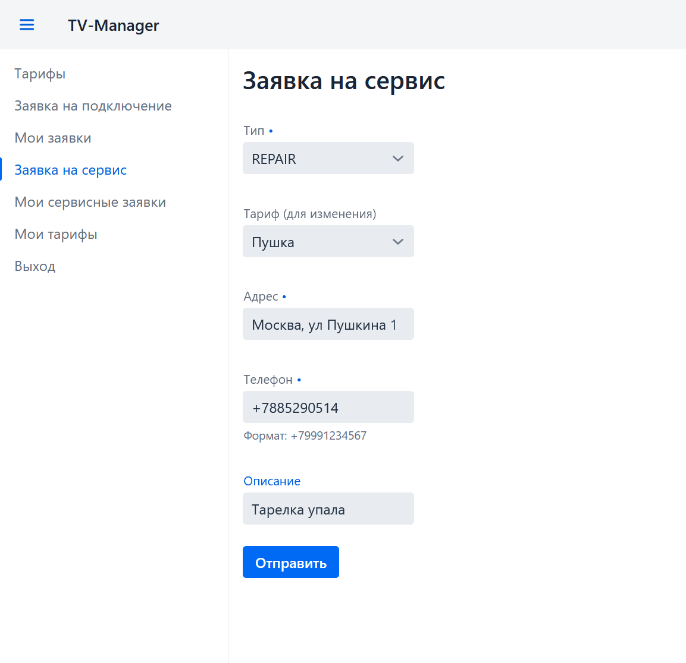
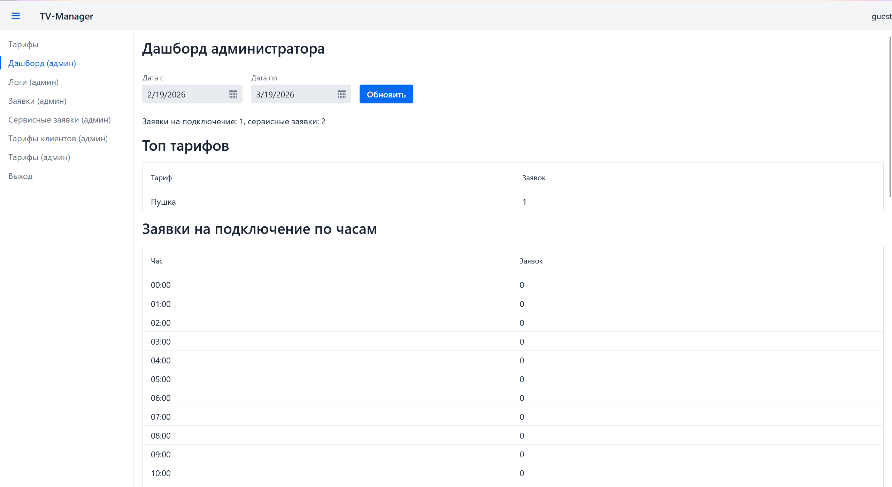
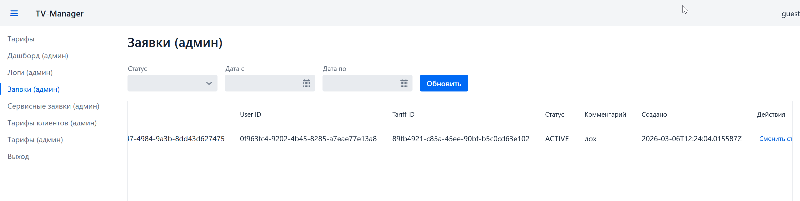
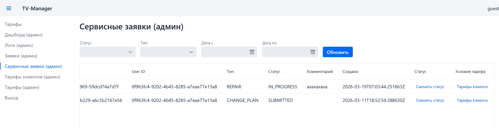
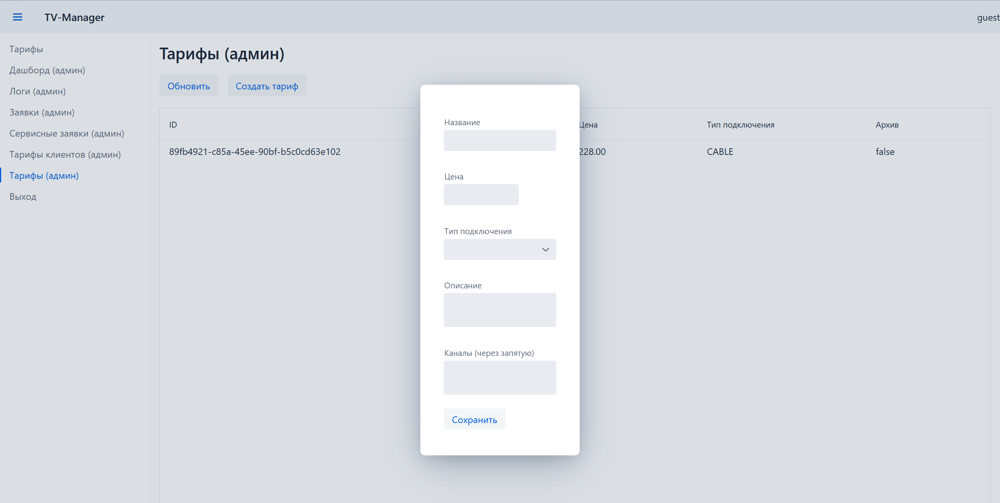
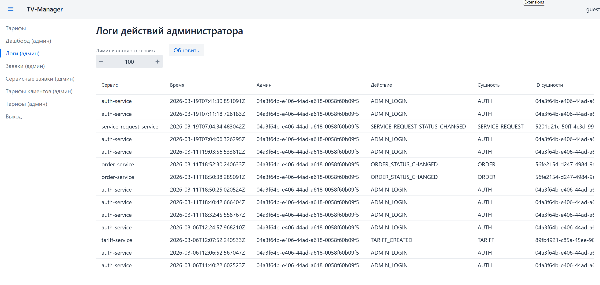

# TV Manager

TV Manager — это микросервисная система на Java 21 для:
- управления тарифами,
- обработки заявок на подключение,
- обработки сервисных заявок,
- админских операций и аудита действий.

В проекте используются Spring Boot, Spring Cloud (Eureka + Gateway), PostgreSQL, Kafka и Vaadin UI.

## Лицензия

Проект распространяется по лицензии MIT. Подробности в файле [LICENSE](./LICENSE).

## Модули

- `discovery-service` — сервис discovery (Eureka).
- `api-gateway` — единая точка входа и проверка JWT.
- `auth-service` — регистрация/вход и выдача JWT.
- `tariff-service` — CRUD тарифов + аудит админов.
- `order-service` — заявки на подключение + клиентские тарифы + аудит админов.
- `service-request-service` — сервисные заявки + аудит админов.
- `ui-service` — веб-интерфейс на Vaadin для клиента и администратора.
- `common-lib` — общие enum, события и модель ошибок.

## Требования

- Docker + Docker Compose (рекомендуемый способ запуска)
- либо локально: Java 21 + Maven + PostgreSQL + Kafka

## Быстрый запуск (Docker)

Из корня проекта:

```bash
docker compose up --build
```

Основные адреса после старта:
- UI: `http://localhost:8090`
- API Gateway: `http://localhost:8080`
- Eureka: `http://localhost:8761`
- Kafka UI: `http://localhost:8085`
- pgAdmin: `http://localhost:5050` (`admin@example.com` / `admin`)

## Локальный запуск (без Docker)

1. Поднять PostgreSQL и создать базы:
   - `auth_db`
   - `tariff_db`
   - `order_db`
   - `service_request_db`
2. Поднять Kafka (и Zookeeper при необходимости).
3. Запускать модули в следующем порядке:
   1. `discovery-service`
   2. `auth-service`, `tariff-service`, `order-service`, `service-request-service`
   3. `api-gateway`
   4. `ui-service`

Пример:

```bash
mvn -pl discovery-service spring-boot:run
mvn -pl auth-service spring-boot:run
mvn -pl tariff-service spring-boot:run
mvn -pl order-service spring-boot:run
mvn -pl service-request-service spring-boot:run
mvn -pl api-gateway spring-boot:run
mvn -pl ui-service spring-boot:run
```

## Конфигурация

Базовые значения уже подготовлены в `docker-compose.yml`. Важные переменные:
- `JWT_SECRET`
- `SPRING_DATASOURCE_URL`, `SPRING_DATASOURCE_USERNAME`, `SPRING_DATASOURCE_PASSWORD`
- `EUREKA_CLIENT_SERVICEURL_DEFAULTZONE`
- `SERVICES_AUTH`, `SERVICES_TARIFF`, `SERVICES_ORDER`, `SERVICES_SERVICEREQUEST` (для `ui-service`)

## Миграции БД

Каждый сервис использует Flyway-миграции из `src/main/resources/db/migration`.

## Документация API

Справочник API находится в [docs/API.md](./docs/API.md):
- auth-эндпоинты,
- тарифы,
- заявки на подключение,
- сервисные заявки,
- аудит админов.

## Скриншоты


### Главные экраны

1. Авторизация (`docs/images/login.png`)



2. Список тарифов клиента (`docs/images/tariffs-list.png`)



3. Создание заявки на подключение (`docs/images/create-order.png`)



4. Создание сервисной заявки (`docs/images/create-service-request.png`)



### Экраны администратора

1. Админский дашборд (`docs/images/admin-dashboard.png`)



2. Заявки на подключение (админ) (`docs/images/admin-orders.png`)



3. Сервисные заявки (админ) (`docs/images/admin-service-requests.png`)



4. Тарифы клиентов (админ) (`docs/images/admin-client-tariffs.png`)



5. Аудит-логи (админ) (`docs/images/admin-audit-logs.png`)


